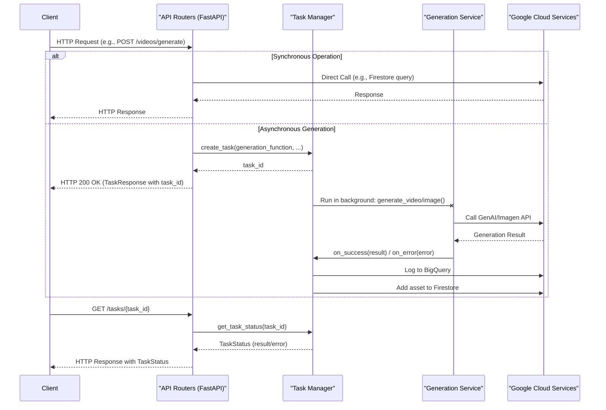

# API Handbook

This document provides a detailed overview of the backend API, including endpoints, data models, and invocation chains.

## 1. API Endpoints

The API is divided into several logical sections, each handled by its own router.

### 1.1. Main API (`/api`)

Handles user authentication, configuration, GCS operations, prompt gallery, image uploads, video editing, groups, creative projects, and analytics.

---

#### **GET /user/me**
- **Description**: Gets details of the current user.
- **Request Body**: None
- **Response Body**:
  ```json
  {
    "authenticated": true,
    "name": "John Doe",
    "email": "john.doe@example.com",
    "picture": "https://example.com/picture.jpg",
    "is_cost_manager": false,
    "role": "USER"
  }
  ```
- **Service/Function Call**: `get_user`

---

#### **GET /config**
- **Description**: Returns public configuration details to the frontend.
- **Request Body**: None
- **Response Body**:
  ```json
  {
    "prompt_gallery_name": "prompt-gallery-collection",
    "enable_upscale": true
  }
  ```
- **Service/Function Call**: `settings`

---

#### **GET /models**
- **Description**: Returns the available video models from the configuration.
- **Request Body**: None
- **Response Body**:
  ```json
  {
    "models": [
      {
        "id": "veo-2.0-generate-001",
        "name": "Veo 2.0",
        "type": "veo-2.0",
        "pricing": [
          {
            "effective_date": "2025-10-01",
            "video_with_audio": 0.50,
            "video_without_audio": 0.50
          }
        ]
      },
      {
        "id": "veo-3.1-generate-preview",
        "name": "Veo 3.1 Preview",
        "type": "veo-3.1",
        "pricing": [
          {
            "effective_date": "2025-09-01",
            "video_with_audio": 0.40,
            "video_without_audio": 0.20
          }
        ]
      }
    ]
  }
  ```
- **Service/Function Call**: `get_models_config`

---

#### **GET /image-models**
- **Description**: Returns the available image models from the configuration.
- **Request Body**: None
- **Response Body**:
  ```json
  {
    "models": [
      {
        "id": "imagen-3.0-generate-001",
        "name": "Imagen 3.0",
        "pricing": {
          "per_image": 0.01
        }
      }
    ]
  }
  ```
- **Service/Function Call**: `get_image_models`

---

#### **GET /notification-banner**
- **Description**: Returns a list of notification banner messages if set in the config.
- **Request Body**: None
- **Response Body**:
  ```json
  {
    "messages": [
      "Welcome to the new and improved VeoSpark!",
      "System maintenance scheduled for Sunday at 2 AM."
    ]
  }
  ```
- **Service/Function Call**: `settings`

---

#### **GET /tasks/{task_id}**
- **Description**: Retrieves the status of a background task.
- **Request Body**: None
- **Response Body**: (See `TaskStatus` schema for detailed examples)
  ```json
  {
    "status": "completed",
    "result": {
      "message": "Video generation successful.",
      "videos": [{"gcs_uri": "...", "signed_url": "..."}],
      "rai_reasons": null
    },
    "error": null
  }
  ```
- **Service/Function Call**: `get_task_status`

---

#### **POST /images/upload**
- **Description**: Uploads an image to GCS and returns its URI.
- **Request Body**: `multipart/form-data` with a file.
- **Response Body**:
  ```json
  {
    "message": "Image uploaded successfully.",
    "gcs_uri": "gs://your-bucket/image_uploads/user_folder/image_uuid.png"
  }
  ```
- **Service/Function Call**: `storage.Client.bucket.blob.upload_from_file`

---

#### **POST /videos/edit**
- **Description**: Edits a video based on the provided parameters (e.g., clipping).
- **Request Body**:
  ```json
  {
    "gcs_uri": "gs://your-bucket/veo_outputs/user_folder/video.mp4",
    "start_time": "00:00:10",
    "end_time": "00:00:20"
  }
  ```
- **Response Body**:
  ```json
  {
    "message": "Video clipped successfully.",
    "processed_video_uri": "gs://your-bucket/veo_outputs/user_folder/processed_video.mp4",
    "signed_url": "https://storage.googleapis.com/your-bucket/..."
  }
  ```
- **Service/Function Call**: `process_video_from_gcs`, `log_generation_to_bq`

---

### 1.2. Videos API (`/videos`)

Handles video generation, history, and sharing.

---

#### **POST /generate**
- **Description**: Generates a video asynchronously.
- **Request Body**: `VideoGenerationRequest` (see schema section for details)
- **Response Body**: `TaskResponse` (see schema section for details)
- **Service/Function Call**: `create_task` -> `generation_service.generate_video`

---

#### **GET /history**
- **Description**: Gets the user's video generation history from BigQuery.
- **Request Body**: None
- **Response Body**:
  ```json
  {
    "rows": [
      {
        "user_email": "user@example.com",
        "trigger_time": "2023-10-27T10:00:00Z",
        "completion_time": "2023-10-27T10:02:00Z",
        "prompt": "A cat riding a skateboard",
        "model_used": "veo-2.0-generate-001",
        "output_video_gcs_paths": "[\"gs://.../video.mp4\"]",
        "signed_urls": ["https://..."],
        "status": "SUCCESS"
      }
    ],
    "total": 1
  }
  ```
- **Service/Function Call**: `bigquery.Client.query`

---

#### **POST /share**
- **Description**: Shares a video to a group.
- **Request Body**:
  ```json
  {
    "video": {
      "output_video_gcs_paths": "[\"gs://.../video.mp4\"]",
      "prompt": "A cat riding a skateboard"
    },
    "group_id": "group-123"
  }
  ```
- **Response Body**:
  ```json
  {
    "message": "Shared successfully",
    "id": "generated-share-id"
  }
  ```
- **Service/Function Call**: `firestore.Client.collection.add`

---

### 1.3. Images API (`/images`)

Handles image generation, imitation, history, and sharing.

---

#### **POST /generate**
- **Description**: Generates an image asynchronously.
- **Request Body**: `ImageGenerationRequest` (see schema section for details)
- **Response Body**: `TaskResponse` (see schema section for details)
- **Service/Function Call**: `create_task` -> `generation_service.generate_image`

---

#### **POST /imitate**
- **Description**: Generates an image based on an uploaded image and a sub-prompt.
- **Request Body**: `multipart/form-data` with a file and form fields (`sub_prompt`, `model`, etc.).
- **Response Body**: `TaskResponse` (see schema section for details)
- **Service/Function Call**: `create_task` -> `generation_service.imitate_image`

---

#### **GET /enrichment-history**
- **Description**: Gets the user's image enrichment history from BigQuery.
- **Request Body**: None
- **Response Body**:
  ```json
  {
    "rows": [
      {
        "user_email": "user@example.com",
        "trigger_time": "2023-10-27T12:00:00Z",
        "completion_time": "2023-10-27T12:00:45Z",
        "prompt": "A detailed description of the enriched image.",
        "model_used": "gemini-pro-vision",
        "output_image_gcs_path": "gs://.../enriched_image.png",
        "signed_url": "https://...",
        "status": "SUCCESS"
      }
    ],
    "total": 1
  }
  ```
- **Service/Function Call**: `bigquery.Client.query`

---

#### **GET /history**
- **Description**: Gets the user's image generation history from BigQuery.
- **Request Body**: None
- **Response Body**:
  ```json
  {
    "rows": [
      {
        "user_email": "user@example.com",
        "trigger_time": "2023-10-27T11:00:00Z",
        "completion_time": "2023-10-27T11:00:30Z",
        "prompt": "A dog wearing sunglasses",
        "model_used": "imagen-3.0-generate-001",
        "output_image_gcs_path": "gs://.../image.png",
        "signed_url": "https://...",
        "status": "SUCCESS"
      }
    ],
    "total": 1
  }
  ```
- **Service/Function Call**: `bigquery.Client.query`

---

#### **POST /share**
- **Description**: Shares an image to a group.
- **Request Body**:
  ```json
  {
    "item": {
      "output_image_gcs_path": "gs://.../image.png",
      "prompt": "A dog wearing sunglasses"
    },
    "group_id": "group-123"
  }
  ```
- **Response Body**:
  ```json
  {
    "message": "Shared successfully",
    "id": "generated-share-id"
  }
  ```
- **Service/Function Call**: `firestore.Client.collection.add`

---

## 2. Data Models (Schemas)

The API uses Pydantic models to define the structure of request and response bodies.

### `VideoGenerationRequest`
Defines the request body for generating a video.
- `prompt` (str): The text prompt for the video generation.
- `model` (Optional[str]): The model to use for generation. Defaults to "veo-2.0-generate-001".
- `aspectRatio` (Optional[str]): The aspect ratio of the video. Defaults to "16:9".
- `duration` (Optional[int]): The duration of the video in seconds. Defaults to 8.
- `sampleCount` (Optional[int]): The number of videos to generate. Defaults to 1.
- `image_gcs_uri` (Optional[str]): GCS URI of an image to use as the first frame.
- `final_frame_gcs_uri` (Optional[str]): GCS URI of an image to use as the last frame.
- `generateAudio` (Optional[bool]): Whether to generate audio for the video. Defaults to `False`.
- `enhancePrompt` (Optional[bool]): Whether to enhance the prompt. Defaults to `True`.
- `extend_duration` (Optional[int]): The duration to extend the video by.
- `resolution` (Optional[str]): The resolution of the video.
- `creative_project_id` (Optional[str]): The ID of the creative project to associate with the video.

**Example Payload:**
```json
{
  "prompt": "A cinematic shot of a panda drinking a milkshake in a cafe.",
  "model": "veo-2.0-generate-001",
  "aspectRatio": "16:9",
  "duration": 10,
  "sampleCount": 1,
  "generateAudio": true,
  "resolution": "1080p",
  "creative_project_id": "project-123"
}
```

### `ImageGenerationRequest`
Defines the request body for generating an image.
- `prompt` (str): The text prompt for the image generation.
- `model` (Optional[str]): The model to use for generation. Defaults to "imagen-3.0-generate-001".
- `negative_prompt` (Optional[str]): A negative prompt to guide the generation.
- `aspect_ratio` (Optional[str]): The aspect ratio of the image. Defaults to "1:1".
- `sample_count` (Optional[int]): The number of images to generate. Defaults to 1.
- `image_size` (Optional[str]): The size of the image. Defaults to "1024x1024".
- `creative_project_id` (Optional[str]): The ID of the creative project to associate with the image.

**Example Payload:**
```json
{
  "prompt": "A photo of a cat wearing a small hat.",
  "model": "imagen-3.0-generate-001",
  "negative_prompt": "blurry, low quality",
  "aspect_ratio": "1:1",
  "sample_count": 2,
  "image_size": "1024x1024",
  "creative_project_id": "project-123"
}
```

### `TaskResponse`
The response for asynchronous tasks, containing a `task_id`.
- `task_id` (str): The ID of the background task.

**Example Payload:**
```json
{
  "task_id": "f47ac10b-58cc-4372-a567-0e02b2c3d479"
}
```

### `VideoData`
Represents a generated video with its GCS URI and a signed URL.
- `gcs_uri` (str): The GCS URI of the video.
- `signed_url` (str): A signed URL to access the video.

**Example Payload:**
```json
{
  "gcs_uri": "gs://your-bucket/veo_outputs/user_email/video.mp4",
  "signed_url": "https://storage.googleapis.com/your-bucket/..."
}
```

### `ImageData`
Represents a generated image with its GCS URI and a signed URL.
- `gcs_uri` (str): The GCS URI of the image.
- `signed_url` (str): A signed URL to access the image.

**Example Payload:**
```json
{
  "gcs_uri": "gs://your-bucket/image_outputs/user_email/image.png",
  "signed_url": "https://storage.googleapis.com/your-bucket/..."
}
```

### `RaiReason`
Represents the reason for a Responsible AI filter being triggered.
- `code` (str): The support code for the RAI reason.
- `category` (str): The category of the RAI reason.
- `description` (str): A description of the RAI reason.
- `filtered` (str): The filtered content.

**Example Payload:**
```json
{
  "code": "VIOLENCE",
  "category": "VIOLENCE",
  "description": "The generated content was filtered due to violence.",
  "filtered": "True"
}
```

### `VideoGenerationResult`
The result of a successful video generation task.
- `message` (str): A message indicating the result of the generation.
- `videos` (List[VideoData]): A list of generated videos.
- `duration` (float): The duration of the generation operation.
- `revisedPrompt` (Optional[str]): The revised prompt used for generation.
- `rai_reasons` (Optional[List[RaiReason]]): A list of RAI reasons if any were triggered.

**Example Payload:**
```json
{
  "message": "Video generation successful.",
  "videos": [
    {
      "gcs_uri": "gs://your-bucket/veo_outputs/user_email/video.mp4",
      "signed_url": "https://storage.googleapis.com/your-bucket/..."
    }
  ],
  "duration": 120.5,
  "revisedPrompt": "A cinematic shot of a panda drinking a milkshake in a cafe, high quality.",
  "rai_reasons": null
}
```

### `ImageGenerationResult`
The result of a successful image generation task.
- `message` (str): A message indicating the result of the generation.
- `images` (List[ImageData]): A list of generated images.
- `duration` (float): The duration of the generation operation.
- `prompt` (str): The prompt used for generation.
- `model_used` (str): The model used for generation.
- `resolution` (str): The resolution of the generated images.
- `rai_reasons` (Optional[List[RaiReason]]): A list of RAI reasons if any were triggered.

**Example Payload:**
```json
{
  "message": "Image generation successful.",
  "images": [
    {
      "gcs_uri": "gs://your-bucket/image_outputs/user_email/image1.png",
      "signed_url": "https://storage.googleapis.com/your-bucket/..."
    },
    {
      "gcs_uri": "gs://your-bucket/image_outputs/user_email/image2.png",
      "signed_url": "https://storage.googleapis.com/your-bucket/..."
    }
  ],
  "duration": 30.2,
  "prompt": "A photo of a cat wearing a small hat.",
  "model_used": "imagen-3.0-generate-001",
  "resolution": "1024x1024",
  "rai_reasons": null
}
```

### `ImageImitationResult`
The result of a successful image imitation task.
- `message` (str): A message indicating the result of the generation.
- `images` (List[ImageData]): A list of generated images.
- `duration` (float): The duration of the generation operation.
- `revised_prompt` (str): The revised prompt used for generation.
- `model` (str): The model used for generation.
- `resolution` (str): The resolution of the generated images.
- `rai_reasons` (Optional[List[RaiReason]]): A list of RAI reasons if any were triggered.

**Example Payload:**
```json
{
  "message": "Image imitation successful.",
  "images": [
    {
      "gcs_uri": "gs://your-bucket/image_outputs/user_email/imitation.png",
      "signed_url": "https://storage.googleapis.com/your-bucket/..."
    }
  ],
  "duration": 45.8,
  "revised_prompt": "A detailed description of the imitated image.",
  "model": "imagen-3.0-generate-001",
  "resolution": "1024x1024",
  "rai_reasons": null
}
```

### `TaskStatus`
Represents the status of a background task, including its result or error.
- `status` (str): The status of the task (e.g., "running", "completed", "failed").
- `result` (Optional[dict]): The result of the task if it was successful. This can also contain error details for handled failures (e.g., RAI violations).
- `error` (Optional[str]): The error message if the task failed unexpectedly.

**Example Payload (Success):**
```json
{
  "status": "completed",
  "result": {
    "message": "Video generation successful.",
    "videos": [
      {
        "gcs_uri": "gs://your-bucket/veo_outputs/user_email/video.mp4",
        "signed_url": "https://storage.googleapis.com/your-bucket/..."
      }
    ],
    "duration": 120.5,
    "revisedPrompt": "A cinematic shot of a panda drinking a milkshake in a cafe, high quality.",
    "rai_reasons": null
  },
  "error": null
}
```

**Example Payload (Handled Failure with RAI Reasons):**
```json
{
  "status": "completed",
  "result": {
    "message": "Video generation failed.",
    "error": "The prompt could not be submitted...",
    "videos": [],
    "duration": 0.5,
    "revisedPrompt": null,
    "rai_reasons": [
      {
        "code": "89371032",
        "category": "Prohibited content",
        "description": "Detects the request of prohibited content in the request.",
        "filtered": "input (prompt)"
      },
      {
        "code": "58061214",
        "category": "Child",
        "description": "Rejects requests to generate content depicting children...",
        "filtered": "input (prompt)"
      }
    ]
  },
  "error": null
}
```

**Example Payload (Unhandled Failure):**
```json
{
  "status": "failed",
  "result": null,
  "error": "An unexpected error occurred during video generation."
}
```

## 3. Invocation Chain

The backend follows a clear invocation chain from API endpoints to services.



This architecture allows the API to handle long-running generation tasks without blocking the client, providing a responsive user experience.
