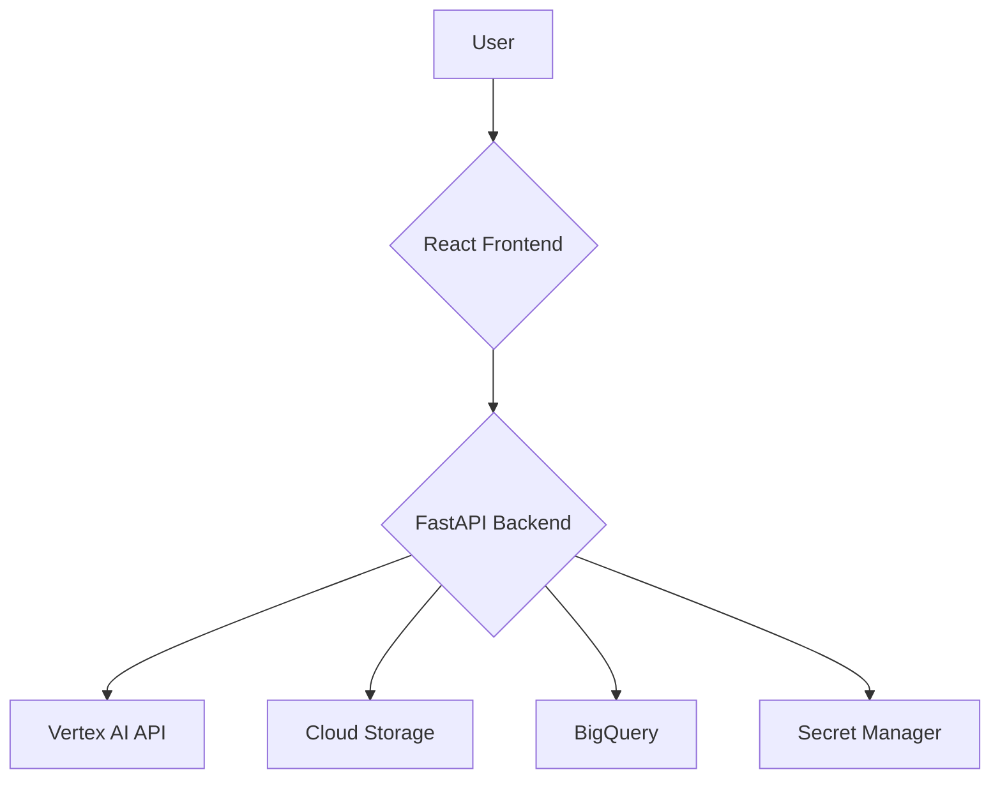

# VeoSpark Video Generation Studio


VeoSpark is a powerful, web-based application designed to generate high-quality videos from text prompts using Google Cloud's advanced AI models. It provides a seamless user experience for video creation, history tracking, and cost analysis, making it an ideal tool for marketing teams, content creators, and developers.

## Table of Contents

- [Features](#features)
- [Tech Stack](#tech-stack)
- [Architecture](#architecture)
- [Google Cloud Setup](#google-cloud-setup)
- [Local Development Setup](#local-development-setup)
- [Usage](#usage)

## Features

-   **AI-Powered Video Generation**: Create stunning videos from simple text prompts using Google's Veo models.
-   **Generation History**: Keep track of all your video generations, including prompts, models used, and status.
-   **Cost Analytics**: Monitor your spending on video generation with detailed analytics and visualizations.
-   **User Authentication**: Secure access to the application with Google OAuth.
-   **Internationalization**: Support for multiple languages (English, Japanese, Chinese).
-   **Video Editing**: Basic video editing features like clipping and dubbing.
-   **Prompt Gallery**: A collaborative space to share and discover creative prompts.

## Tech Stack

### Frontend

-   **React**: A JavaScript library for building user interfaces.
-   **Material-UI (MUI)**: A popular React UI framework for faster and easier web development.
-   **axios**: A promise-based HTTP client for the browser and Node.js.
-   **Recharts**: A composable charting library built on React components.
-   **i18next**: An internationalization-framework written in and for JavaScript.

### Backend

-   **FastAPI**: A modern, fast (high-performance), web framework for building APIs with Python 3.7+ based on standard Python type hints.
-   **Google Cloud Libraries**:
    -   `google-cloud-aiplatform`: For accessing Vertex AI services.
    -   `google-cloud-storage`: For interacting with Cloud Storage.
    -   `google-cloud-secret-manager`: For managing secrets.
    -   `google-cloud-bigquery`: For working with BigQuery.
-   **Authlib**: The ultimate Python library in building OAuth and OpenID Connect clients and providers.
-   **MoviePy**: A Python module for video editing.
-   **google-cloud-firestore**: For a flexible, scalable database for mobile, web, and server development.
-   **Docker**: A platform for developing, shipping, and running applications in containers.

## Architecture

The application consists of a React frontend and a FastAPI backend, both interacting with various Google Cloud services.



## Google Cloud Setup

To run this application, you need to set up the following Google Cloud services:

### 1. Google Cloud Project

-   Create a new Google Cloud project in the [Google Cloud Console](https://console.cloud.google.com/).

### 2. Enable APIs

-   Enable the following APIs for your project:
    -   Vertex AI API
    -   Cloud Storage API
    -   BigQuery API
    -   Secret Manager API

### 3. Cloud Storage

-   Create a Cloud Storage bucket to store the generated videos and uploaded images.

### 4. Firestore

-   Enable the Firestore API in your Google Cloud project.
-   Create a new Firestore database in **Native mode**.
-   By default, the application uses the `(default)` database. To use a different database for the prompt gallery, you can specify the database name in the `PROMPT_GALLERY_DB` field in `src/backend/app-config.yaml`.

### 5. BigQuery

-   Create a BigQuery dataset (e.g., `marketing_materials_analysis`).
-   Create a table within the dataset (e.g., `veo_history`) with the following schema:

| Field Name                 | Type      |
| -------------------------- | --------- |
| `user_email`               | `STRING`  |
| `trigger_time`             | `TIMESTAMP` |
| `completion_time`          | `TIMESTAMP` |
| `operation_duration`       | `FLOAT`   |
| `prompt`                   | `STRING`  |
| `model_used`               | `STRING`  |
| `status`                   | `STRING`  |
| `error_message`            | `STRING`  |
| `video_duration`           | `INTEGER` |
| `input_image_gcs_path`     | `STRING`  |
| `with_audio`               | `BOOLEAN` |
| `output_video_gcs_paths`   | `STRING`  |
| `enhanced_prompt`          | `STRING`  |


### 6. Authentication

-   **OAuth 2.0 Client ID**:
    -   Go to "APIs & Services" > "Credentials".
    -   Click "Create Credentials" > "OAuth client ID".
    -   Select "Web application" as the application type.
    -   Add `http://localhost:3000` to the "Authorized JavaScript origins".
    -   Add `http://localhost:7860/auth` to the "Authorized redirect URIs".
    -   Take note of the "Client ID" and "Client secret".
-   **Secret Manager**:
    -   Create a new secret in Secret Manager.
    -   Store the "Client ID" and "Client secret" as a JSON object in the secret value, like this:
        ```json
        {
          "GOOGLE_CLIENT_ID": "YOUR_CLIENT_ID",
          "GOOGLE_CLIENT_SECRET": "YOUR_CLIENT_SECRET"
        }
        ```

## Local Development Setup

### Prerequisites

-   [Node.js](https://nodejs.org/) (v16 or later)
-   [Python](https://www.python.org/) (v3.9 or later)
-   [Google Cloud SDK](https://cloud.google.com/sdk/docs/install)

### Backend Setup

1.  **Navigate to the backend directory**:
    ```bash
    cd src/backend
    ```
2.  **Create a virtual environment**:
    ```bash
    python3 -m venv venv
    source venv/bin/activate
    ```
3.  **Install dependencies**:
    ```bash
    pip install -r requirements.txt
    ```
4.  **Configure the application**:
    -   Rename `app-config.yaml.example` to `app-config.yaml`.
    -   Update the values in `app-config.yaml` with your Google Cloud project details.
5.  **Run the backend server**:
    ```bash
    uvicorn main:app --reload
    ```

### Frontend Setup

1.  **Navigate to the frontend directory**:
    ```bash
    cd src/frontend
    ```
2.  **Install dependencies**:
    ```bash
    npm install
    ```
3.  **Run the frontend server**:
    ```bash
    npm start
    ```

## Docker Setup

### Prerequisites

-   [Docker](https://www.docker.com/get-started)

### Build and Run with Docker

1.  **Build the backend image**:
    ```bash
    docker build -t veo-backend src/backend
    ```
2.  **Run the backend container**:
    ```bash
    docker run -p 7860:7860 --name veo-backend-container -d veo-backend
    ```
3.  **Build the frontend image**:
    ```bash
    docker build -t veo-frontend src/frontend
    ```
4.  **Run the frontend container**:
    ```bash
    docker run -p 3000:3000 --name veo-frontend-container -d veo-frontend
    ```

## Usage

1.  Open your browser and navigate to `http://localhost:3000`.
2.  Log in with your Google account.
3.  Use the "Video Generator" tab to create new videos.
4.  View your past creations in the "My History" tab.
5.  Monitor your usage costs in the "Analytics" tab.
