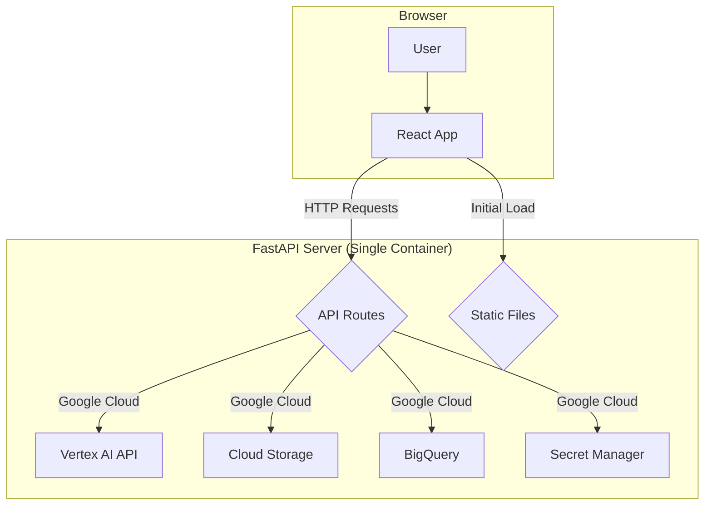

# VeoSpark Video Generation Studio


VeoSpark is a powerful, web-based application designed to generate high-quality videos from text prompts using Google Cloud's advanced AI models. It provides a seamless user experience for video creation, history tracking, and cost analysis, making it an ideal tool for marketing teams, content creators, and developers.

## Table of Contents

- [Features](#features)
- [Tech Stack](#tech-stack)
- [Architecture](#architecture)
- [Model Configuration](#model-configuration)
- [Google Cloud Setup](#google-cloud-setup)
- [Running the Application Locally](#running-the-application-locally)
- [Usage](#usage)
- [Change Log](#change-log)

## Features

-   **Unified Creative Production**: A streamlined interface for generating both videos and images from a single, unified tab.
-   **AI-Powered Video & Image Generation**: Create stunning videos and images from simple text prompts using Google's Veo and Imagen models.
-   **Image-to-Video Workflow**: Seamlessly use any generated or shared image as the first frame for a new video generation, bridging the gap between image and video creation.
-   **Dynamic Model Configuration**: Easily add, remove, or update Veo and Imagen models and their pricing through simple `.yaml` files without changing any code.
-   **Image-to-Prompt Generation**: Upload a character, background, and/or prop image to generate a descriptive prompt using Gemini 2.5 Pro.
-   **Image Imitation**: Upload an image, get a description from Gemini, customize the prompt, and generate a new image.
-   **Prompt Translation**: Instantly translate generated prompts into different languages using Gemini 2.5 Flash.
-   **Generation History & Caching**: Keep track of all your video and image generations. The history page now caches data for faster load times when switching between tabs.
-   **Comprehensive Cost Analytics**: Monitor your spending with a detailed dashboard that provides a complete overview of both video and image creation costs.
-   **User Authentication**: Secure access to the application with Google OAuth.
-   **Internationalization**: Support for multiple languages (English, Japanese, Chinese).
-   **Video Editing**: Basic video editing features like clipping and dubbing.
-   **Video Upscaling**: Upscale videos to 1080p or 4K using an asynchronous task queue.
-   **Team Gallery & Sharing**: Share videos and images with user-managed groups. Shared items retain all original generation details.
-   **Prompt Gallery**: A collaborative space to share and discover creative prompts.
-   **Group Management**: Admins can create user groups and manage memberships, including bulk add/remove functionality.
-   **Improved UI/UX**: The Image Generator now features a two-column layout, and tooltips on item cards have been improved to be more concise and visually appealing.

## Tech Stack

### Frontend

-   **React**: A JavaScript library for building user interfaces.
-   **Material-UI (MUI)**: A popular React UI framework for faster and easier web development.
-   **axios**: A promise-based HTTP client for the browser and Node.js.
-   **Recharts**: A composable charting library built on React components.
-   **i18next**: An internationalization-framework written in and for JavaScript.

### Backend

-   **FastAPI**: A modern, fast (high-performance), web framework for building APIs and serving web content.
-   **Google Cloud Libraries**:
    -   `google-cloud-aiplatform`: For accessing Vertex AI services.
    -   `google-cloud-storage`: For interacting with Cloud Storage.
    -   `google-cloud-secret-manager`: For managing secrets.
    -   `google-cloud-bigquery`: For working with BigQuery.
    -   `google-cloud-tasks`: For creating and managing tasks in Cloud Tasks.
-   **Authlib**: The ultimate Python library in building OAuth and OpenID Connect clients and providers.
-   **MoviePy**: A Python module for video editing.
-   **google-cloud-firestore**: For a flexible, scalable database for mobile, web, and server development.
-   **Docker**: A platform for developing, shipping, and running applications in containers.

## Architecture

The application runs as a single FastAPI service that serves the React frontend and provides the backend API. This simplifies deployment and eliminates CORS issues.



## Model Configuration

VeoSpark allows for easy management of Veo models through the `src/backend/models.yaml` file. This file centralizes model definitions and pricing, allowing administrators to add, remove, or update models without any code changes.

### Structure of `models.yaml`

The file contains a list of model objects, each with the following properties:

-   `id`: The unique identifier for the model used by the API.
-   `name`: The user-friendly display name for the model in the UI.
-   `type`: The model type (e.g., `veo-2.0`, `veo-3.0`), used for conditional logic in the application.
-   `pricing`: An object containing the cost per second for video generation.
    -   `video_with_audio`: Cost per second for generating video with audio.
    -   `video_without_audio`: Cost per second for generating video without audio.

### Example `models.yaml`

```yaml
models:
  - id: "veo-2.0-generate-001"
    name: "Veo 2.0"
    type: "veo-2.0"
    pricing:
      video_with_audio: 0.50
      video_without_audio: 0.50
  - id: "veo-3.0-generate-preview"
    name: "Veo 3.0 Preview"
    type: "veo-3.0"
    pricing:
      video_with_audio: 0.75
      video_without_audio: 0.50
  - id: "veo-3.0-fast-generate-preview"
    name: "Veo 3.0 Fast Preview"
    type: "veo-3.0"
    pricing:
      video_with_audio: 0.40
      video_without_audio: 0.25
```

To add a new model, simply append a new entry to the `models` list in this file. The application will automatically pick up the new model and make it available in the UI.

## Google Cloud Setup

To run this application, you need to set up the following Google Cloud services:

### 1. Google Cloud Project

-   Create a new Google Cloud project in the [Google Cloud Console](https://console.cloud.google.com/).

### 2. Enable APIs

-   Enable the following APIs for your project:
    -   Vertex AI API
    -   Cloud Storage API
    -   BigQuery API
    -   Secret Manager API
    -   Cloud Tasks API

### 3. Cloud Storage

-   Create a Cloud Storage bucket to store the generated videos and uploaded images.

### 4. Firestore

-   Enable the Firestore API in your Google Cloud project.
-   Create a new Firestore database in **Native mode**.
-   By default, the application uses the `(default)` database. To use a different database for the prompt gallery, you can specify the database name in the `PROMPT_GALLERY_DB` field in `src/backend/app-config.yaml`.

#### Creating Firestore via Command Line
You can enable the API and create the database using the `gcloud` CLI:

1.  **Enable the API**:
    ```bash
    gcloud services enable firestore.googleapis.com
    ```

2.  **Create the databases in `us-central1`**:
    ```bash
    # Create the database for the prompt gallery
    gcloud firestore databases create --database="prompt-gallery" --location=us-central1

    # Create the database for application configuration
    gcloud firestore databases create --database="veo-app-config" --location=us-central1

    # Create the database for user groups
    gcloud firestore databases create --database="veo-app-user-groups" --location=us-central1

    # Create the database for shared videos
    gcloud firestore databases create --database="veo-app-shared-videos" --location=us-central1
    ```

#### Deploying Firestore Indexes

To ensure your Firestore queries are efficient, you need to deploy the required indexes.

1.  **Navigate to the backend directory**:
    ```bash
    cd src/backend
    ```

2.  **Run the setup script**:
    This script will deploy the indexes from `firestore_index.json`.
    ```bash
    ./setup_firestore.sh
    ```
    The script will automatically use the `PROJECT_ID` and `PROMPT_GALLERY_DB` from your `app-config.yaml` file.

### 5. Cloud Tasks

- Create a Cloud Tasks queue for handling asynchronous video upscaling.
    ```bash
    gcloud tasks queues create veo-upscale-queue --location=us-central1
    ```

### 6. BigQuery

You can create the required BigQuery dataset and table by running the provided setup script.

1.  **Navigate to the backend directory**:
    ```bash
    cd src/backend
    ```

2.  **Make the script executable**:
    ```bash
    chmod +x setup_bigquery.sh
    ```

3.  **Run the script**:
    Replace `YOUR_DATASET_ID` and `YOUR_TABLE_ID` with the names you configured in `app-config.yaml`.
    ```bash
    ./setup_bigquery.sh YOUR_DATASET_ID YOUR_TABLE_ID
    ```
    For example:
    ```bash
    ./setup_bigquery.sh marketing_materials_analysis veo_history
    ```
    The script will create the dataset and the table with the correct schema defined in `schema.json`.

### 7. BigQuery for Imagen History

You can create the required BigQuery table for Imagen history logging by running the provided setup script.

1.  **Navigate to the backend directory**:
    ```bash
    cd src/backend
    ```

2.  **Make the script executable**:
    ```bash
    chmod +x setup_imagen_bigquery.sh
    ```

3.  **Run the script**:
    ```bash
    ./setup_imagen_bigquery.sh
    ```
    The script will automatically use the `PROJECT_ID` and `ANALYSIS_DATASET` from your `app-config.yaml` file and create the `imagen_history` table with the schema from `schema_imagen_history.json`.

### 8. Create a Service Account

It is recommended to create a dedicated service account for this application to follow the principle of least privilege.

1.  **Go to the Service Accounts page** in the [Google Cloud Console](https://console.cloud.google.com/iam-admin/serviceaccounts).
2.  Click **Create service account**.
3.  Enter the service account name as `veo-spark-sa` and provide an optional description.
4.  Click **Create and continue**.
5.  **Grant the following roles** to the service account:
    -   BigQuery Data Editor
    -   BigQuery Job User
    -   Cloud Datastore User
    -   Compute Network Admin
    -   Secret Manager Secret Accessor
    -   Service Account Token Creator
    -   Storage Admin
    -   Storage Object Admin
    -   Vertex AI Administrator
    -   Vertex AI User
    -   Workload Identity User
    -   Cloud Tasks Enqueuer
6.  Click **Done**.

### 9. Authentication

-   **OAuth 2.0 Client ID**:
    -   Go to "APIs & Services" > "Credentials".
    -   Click "Create Credentials" > "OAuth client ID".
    -   Select "Web application" as the application type.
    -   Add `http://<your_domain>` to the "Authorized JavaScript origins".
    -   Add `http://<your_domain>/auth` to the "Authorized redirect URIs".
    -   For production, add your public URL (e.g., `https://your-app-url.com`) to origins and `https://your-app-url.com/auth` to redirect URIs.
    -   Take note of the "Client ID" and "Client secret".
-   **Secret Manager**:
    -   Go to the [Secret Manager](https://console.cloud.google.com/security/secret-manager) page in the Google Cloud Console.
    -   Click **Create secret**.
    -   Enter a name for your secret (e.g., `veo-oauth-secret`). Note this name for your `app-config.yaml`.
    -   In the **Secret value** field, paste the following JSON, replacing the placeholder values with your actual Client ID and Client Secret:
        ```json
        {
          "GOOGLE_CLIENT_ID": "YOUR_CLIENT_ID",
          "GOOGLE_CLIENT_SECRET": "YOUR_CLIENT_SECRET"
        }
        ```
    -   Leave the other settings as default and click **Create secret**.
    -   After the secret is created, you need to grant the `veo-spark-sa` service account access to it.
        -   Go back to the [Secret Manager](https://console.cloud.google.com/security/secret-manager) page, select your secret, and click **Permissions**.
        -   Click **Add principal**.
        -   In the **New principals** field, enter the email of the `veo-spark-sa` service account. It will look like `veo-spark-sa@[YOUR_PROJECT_ID].iam.gserviceaccount.com`.
        -   In the **Select a role** dropdown, choose **Secret Manager Secret Accessor**.
        -   Click **Save**.

## Running the Application Locally

### Prerequisites

-   [Node.js](https://nodejs.org/) (v16 or later)
-   [Python](https://www.python.org/) (v3.9 or later)
-   [Google Cloud SDK](https://cloud.google.com/sdk/docs/install)

### Setup and Run

1.  **Install Frontend Dependencies**:
    ```bash
    cd src/frontend
    npm install
    ```

2.  **Build the Frontend**:
    This step bundles the React application into static HTML, CSS, and JavaScript files.
    ```bash
    npm run build
    ```

3.  **Copy Static Files to Backend**:
    The FastAPI backend needs the frontend's build artifacts to serve them.
    ```bash
    # On macOS or Linux
    cp -R build/* ../backend/static/

    # On Windows (Command Prompt)
    xcopy build ..\backend\static\ /E /I /Y
    ```
    *Note: You may need to create the `src/backend/static` directory if it doesn't exist.*

4.  **Install Backend Dependencies**:
    ```bash
    cd ../backend 
    # If you are not already in the backend directory
    
    python3 -m venv venv
    source venv/bin/activate
    pip install -r requirements.txt
    ```

5.  **Configure the Application**:
    -   In `src/backend/`, update the values in `app-config.yaml` with your Google Cloud project details.
    -   In `src/backend/`, update the models in `models.yaml` as needed.

6.  **Run the Server**:
    From the `src/backend` directory, run the following command:
    ```bash
    # (Optional) Set environment variables for local OAuth
    export FRONTEND_URL="http://localhost:7860"
    export REDIRECT_URI="http://localhost:7860/auth"
    
    OR -
    
    export FRONTEND_URL: https://veo.vc7.info
    export REDIRECT_URI: https://veo.vc7.info/auth

    uvicorn main:app --host 0.0.0.0 --port 7860 --reload
    ```

## Usage

1.  Open your browser and navigate to `http://<FRONTEND_URI>`.
2.  Log in with your Google account.
3.  Use the "Video Generator" tab to create new videos.
4.  View your past creations in the "My History" tab.
5.  Monitor your usage costs in the "Analytics" tab.

## Change Log

- **v1.6**
    - Redesigned the entire frontend with Ant Design for a more modern and consistent look and feel.
    - Implemented a theme switcher to allow users to toggle between light and dark modes.
    - Added a "frosted glass" effect to the UI for a more premium feel.
    - Added a feature to export consumption data from the Analytics Tab as a CSV or Excel file.
    - Unified the title styles of all tabs.
    - Fixed various UI/UX issues based on user feedback.
- **v1.5**
    - Add feature - Image Imitation
    - Add Resolution 1080p for Veo3
- **v1.4**
    - Add Imagen4 feature, Consumption analysis
- **v1.3**
    - Add feature of Groups Management / Team Gallery / Prompt from Images
- **v1.2**
    - Change display to Gallery
- **v1.1**
    - Refactor frontend and backend logic
- **v1.0**
    - Correct history.model display
    - Add Veo3-fast and enhance VideoCard display
    - Add Camera movement options
    - Add missing i18n
    - Add step to create veo-app-config firestore database.
    - Add model filtering
    - Add Service Account creation steps
    - Refine step of creating Secret
    - Fix firestore index issue
    - Add Pagination
    - Add Configuration Tabs
    - Add Veo2 support
    - Init Commit
