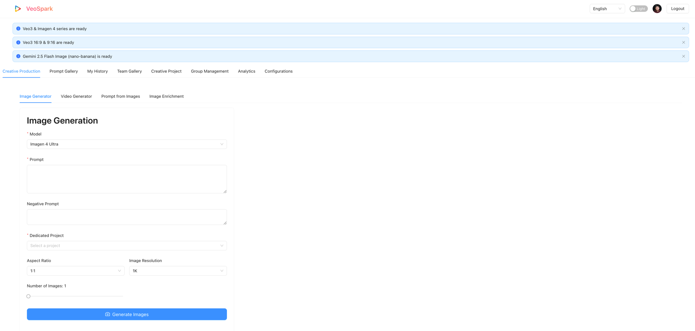
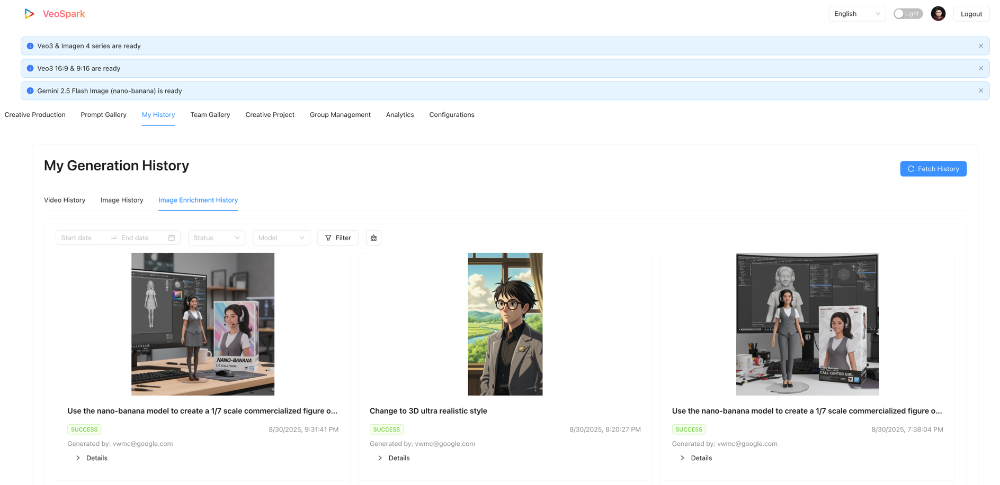

# VeoSpark Video Generation Studio


VeoSpark is a powerful, web-based application designed to generate high-quality videos from text prompts using Google Cloud's advanced AI models. It provides a seamless user experience for video creation, history tracking, and cost analysis, making it an ideal tool for marketing teams, content creators, and developers.

## Table of Contents

- [Features](#features)
- [Tech Stack](#tech-stack)
- [Architecture](#architecture)
- [Project Structure](#project-structure)
- [Model Configuration](#model-configuration)
- [Google Cloud Setup](#google-cloud-setup)
- [Running the Application Locally](#running-the-application-locally)
- [Usage](#usage)
- [Screenshots](#screenshots)
- [Change Log](#change-log)

## Features

-   **Unified Creative Production**: A streamlined interface for generating both videos and images from a single, unified tab.
-   **AI-Powered Video & Image Generation**: Create stunning videos and images from simple text prompts using Google's Veo and Imagen models.
-   **Image-to-Video Workflow**: Seamlessly use any generated or shared image as the first frame for a new video generation, bridging the gap between image and video creation.
-   **Dynamic Model Configuration**: Easily add, remove, or update Veo and Imagen models and their pricing through simple `.yaml` files without changing any code.
-   **Image-to-Prompt Generation**: Upload a character, background, and/or prop image to generate a descriptive prompt using Gemini 2.5 Pro.
-   **Image Imitation**: Upload an image, get a description from Gemini, customize the prompt, and generate a new image.
-   **Prompt Translation**: Instantly translate generated prompts into different languages using Gemini 2.5 Flash.
-   **Generation History & Caching**: Keep track of all your video and image generations. The history page now caches data for faster load times when switching between tabs.
-   **Comprehensive Cost Analytics**: Monitor your spending with a detailed dashboard that provides a complete overview of both video and image creation costs.
-   **Cost by Creative Project**: Analyze costs broken down by creative projects, allowing for better budget tracking and project management.
-   **Project-Specific Cost-Limitation**: In addition to global cost controls, administrators can set specific cost limits for each creative project. This includes daily, weekly, and total cost limits, as well as the option to mark a project as unrestricted.
-   **User Authentication**: Secure access to the application with Google OAuth.
-   **Internationalization**: Support for multiple languages (English, Japanese, Chinese).
-   **Video Editing**: Basic video editing features like clipping and dubbing.
-   **Video Upscaling**: Upscale videos to 1080p or 4K using an asynchronous task queue.
-   **Team Gallery & Sharing**: Share videos and images with user-managed groups. Shared items retain all original generation details.
-   **Prompt Gallery**: A collaborative space to share and discover creative prompts.
-   **Group Management**: Admins can create user groups and manage memberships, including bulk add/remove functionality.
-   **Improved UI/UX**: The Image Generator now features a two-column layout, and tooltips on item cards have been improved to be more concise and visually appealing.
-   **Enhanced Error Handling**: The application now provides detailed information about Responsible AI (RAI) violations, including multiple error codes and descriptions, in a clear and structured table format.

## Tech Stack

### Frontend

-   **React**: A JavaScript library for building user interfaces.
-   **Material-UI (MUI)**: A popular React UI framework for faster and easier web development.
-   **axios**: A promise-based HTTP client for the browser and Node.js.
-   **Recharts**: A composable charting library built on React components.
-   **i18next**: An internationalization-framework written in and for JavaScript.

### Backend

-   **FastAPI**: A modern, fast (high-performance), web framework for building APIs and serving web content.
-   **Google Cloud Libraries**:
    -   `google-cloud-aiplatform`: For accessing Vertex AI services.
    -   `google-cloud-storage`: For interacting with Cloud Storage.
    -   `google-cloud-secret-manager`: For managing secrets.
    -   `google-cloud-bigquery`: For working with BigQuery.
    -   `google-cloud-tasks`: For creating and managing tasks in Cloud Tasks.
-   **Authlib**: The ultimate Python library in building OAuth and OpenID Connect clients and providers.
-   **MoviePy**: A Python module for video editing.
-   **google-cloud-firestore**: For a flexible, scalable database for mobile, web, and server development.
-   **Docker**: A platform for developing, shipping, and running applications in containers.

## Architecture

The application is designed as a monolithic service, where a single FastAPI backend serves both the API and the React frontend. This architecture simplifies deployment and avoids Cross-Origin Resource Sharing (CORS) issues.

### Backend

The backend is built with FastAPI and is responsible for handling all business logic, including user authentication, video and image generation, and communication with Google Cloud services.

-   **`main.py`**: The entry point of the FastAPI application. It sets up the middleware, mounts the static frontend files, and includes the API routers.
-   **`routers/`**: This directory contains the API endpoints, organized by functionality:
    -   `api.py`: General-purpose endpoints for user management, configuration, and analytics.
    -   `videos.py`: Endpoints for video generation, history, and editing.
    -   `images.py`: Endpoints for image generation, history, and sharing.
-   **`services.py`**: Contains the core business logic. The `GenerationService` class orchestrates the interaction with Google's AI models, while the `VeoApiClient` handles communication with the Vertex AI API.
-   **`dependencies.py`**: Manages dependencies for the application, such as database clients and the `GenerationService`.
-   **`config_manager.py`**: Handles loading and saving of application and model configurations from `.yaml` files.
-   **`task_manager.py`**: Manages asynchronous tasks, such as video upscaling, using Google Cloud Tasks.

### Frontend

The frontend is a single-page application (SPA) built with React. It provides a user-friendly interface for interacting with the backend services.

-   **`src/App.js`**: The main component that sets up the application's routing and layout.
-   **`src/components/`**: Contains reusable React components used throughout the application.
-   **`src/pages/`**: Contains the main pages of the application, such as the Home Page, History Page, and Analytics Page.
-   **`src/contexts/`**: Contains React contexts for managing global state, such as the current user and theme.

### Mermaid Diagram


## Project Structure

```
.
├── src
│   ├── backend
│   │   ├── routers
│   │   │   ├── api.py
│   │   │   ├── images.py
│   │   │   └── videos.py
│   │   ├── static
│   │   ├── app-config.yaml
│   │   ├── config_manager.py
│   │   ├── config.py
│   │   ├── dependencies.py
│   │   ├── main.py
│   │   ├── models.yaml
│   │   ├── image-models.yaml
│   │   ├── image-enrichment-models.yaml
│   │   ├── prompts.py
│   │   ├── requirements.txt
│   │   ├── schemas.py
│   │   ├── services.py
│   │   └── task_manager.py
│   └── frontend
│       ├── public
│       └── src
│           ├── components
│           ├── contexts
│           ├── hooks
│           ├── locales
│           └── pages
└── README.md
```

## Cost and Pricing System

The application features a robust, version-controlled pricing system that ensures historical cost accuracy while allowing for future price changes.

### Key Concepts

1.  **Versioned Pricing**: Instead of a single price, each model's cost is defined in a list of pricing tiers, each with an `effective_date`. This allows for scheduling future price changes without any code modification.
2.  **Cost Solidification**: When a generation task (video, image, or enrichment) is completed, its cost is calculated immediately based on the pricing active at that moment. This calculated `cost` is then stored permanently in its BigQuery history record.
3.  **Accurate Analytics**: The analytics dashboards read directly from the stored `cost` field in BigQuery. This guarantees that reports always reflect the historical cost at the time of generation, regardless of subsequent price changes.

This design ensures that the system is both flexible for future business needs and accurate for historical reporting.

## Model Configuration

VeoSpark allows for easy management of all generative models through three distinct `.yaml` files in the `src/backend/` directory. This separation allows for clear and specific pricing models for each generation type.

### 1. `models.yaml` (Video Generation)

-   **Purpose**: Defines Veo models used for video generation.
-   **Pricing**: Priced per second, with different rates for video with and without audio.
-   **Structure**:
    -   `id`, `name`, `type`
    -   `pricing`: A list of pricing tiers.
        -   `effective_date`: The date the pricing tier becomes active (YYYY-MM-DD).
        -   `video_with_audio`: Cost per second.
        -   `video_without_audio`: Cost per second.

### 2. `image-models.yaml` (Image Generation)

-   **Purpose**: Defines Imagen models used for standard image generation.
-   **Pricing**: Priced per image.
-   **Structure**:
    -   `id`, `name`, `type`
    -   `pricing`: A list of pricing tiers.
        -   `effective_date`: The date the pricing tier becomes active.
        -   `per_image`: The cost for a single generated image.

### 3. `image-enrichment-models.yaml` (Image Enrichment)

-   **Purpose**: Defines Gemini models used for the Image Enrichment feature.
-   **Pricing**: Priced per one million input and output tokens.
-   **Structure**:
    -   `id`, `name`, `type`
    -   `pricing`: A list of pricing tiers.
        -   `effective_date`: The date the pricing tier becomes active.
        -   `cost_per_million_input_token`: The cost for 1M input tokens.
        -   `cost_per_million_output_token`: The cost for 1M output tokens.

### Example of Versioned Pricing (`image-enrichment-models.yaml`)

```yaml
models:
  - id: "gemini-2.5-flash"
    name: "Gemini 2.5 Flash"
    type: "gemini-2.5"
    pricing:
      - effective_date: "2020-01-01"
        cost_per_million_input_token: 1.50
        cost_per_million_output_token: 2.50
      - effective_date: "2025-09-01"
        cost_per_million_input_token: 2.00
        cost_per_million_output_token: 3.00
```

To add a new model or update pricing, simply edit the appropriate `.yaml` file. The application will automatically apply the changes based on the `effective_date`.

## Google Cloud Setup

To run this application, you need to set up the following Google Cloud services:

### 1. Google Cloud Project

-   Create a new Google Cloud project in the [Google Cloud Console](https://console.cloud.google.com/).

### 2. Enable APIs

-   Enable the following APIs for your project by running this command:
    ```bash
    gcloud services enable \
        aiplatform.googleapis.com \
        storage.googleapis.com \
        bigquery.googleapis.com \
        secretmanager.googleapis.com \
        cloudtasks.googleapis.com \
        iam.googleapis.com \
        firestore.googleapis.com
    ```

### 3. Network Setup

-   **Create a VPC**:
    ```bash
    gcloud compute networks create veospark-vpc --subnet-mode=custom
    ```
-   **Create a subnet**:
    ```bash
    gcloud compute networks subnets create us-central1 \
        --network=veospark-vpc \
        --range=10.0.0.0/24 \
        --region=us-central1
    ```
-   **Add firewall rules**:
    -   Allow HTTPS Ingress:
        ```bash
        gcloud compute firewall-rules create allow-https \
            --network=veospark-vpc \
            --allow=tcp:443 \
            --direction=INGRESS \
            --source-ranges=0.0.0.0/0
        ```
    -   Allow All Egress:
        ```bash
        gcloud compute firewall-rules create allow-egress \
            --network=veospark-vpc \
            --allow=all \
            --direction=EGRESS \
            --destination-ranges=0.0.0.0/0
        ```
    -   Allow Load Balancer Health Checks:
        ```bash
        gcloud compute firewall-rules create allow-lb-health-check \
            --network=veospark-vpc \
            --allow=tcp:443 \
            --direction=INGRESS \
            --source-ranges=35.191.0.0/16,130.211.0.0/22,209.85.152.0/22,209.85.204.0/22
        ```

### 4. Cloud Storage

-   Create a Cloud Storage bucket to store the generated videos and uploaded images.
    ```bash
    #!/bin/bash
    BUCKET_NAME=$(grep VIDEO_BUCKET_NAME app-config.yaml | awk '{print $2}')
    gcloud storage buckets create gs://$BUCKET_NAME --location=us-central1
    ```

### 5. Firestore

-   Enable the Firestore API in your Google Cloud project.
-   Create a new Firestore database in **Native mode**.
-   By default, the application uses the `(default)` database. To use a different database for the prompt gallery, you can specify the database name in the `PROMPT_GALLERY_DB` field in `src/backend/app-config.yaml`.

#### Creating Firestore via Command Line
You can enable the API and create the database using the `gcloud` CLI:

1.  **Create the databases in `us-central1`**:
    ```bash
    # Create the database for the prompt gallery
    gcloud firestore databases create --database="veo-prompt-gallery" --location=us-central1

    # Create the database for application configuration
    gcloud firestore databases create --database="veo-app-config" --location=us-central1

    # Create the database for user groups
    gcloud firestore databases create --database="veo-app-user-groups" --location=us-central1

    # Create the database for shared videos
    gcloud firestore databases create --database="veo-app-shared-videos" --location=us-central1

    # Create the database for creative projects
    gcloud firestore databases create --database="veo-creative-projects" --location=us-central1
    ```

#### Deploying Firestore Indexes

To ensure your Firestore queries are efficient, you need to deploy the required indexes.

1.  **Navigate to the backend directory**:
    ```bash
    cd src/backend
    ```

2.  **Run the setup script**:
    This script will deploy the indexes from `firestore_index.json`.
    ```bash
    ./setup_firestore.sh
    ```
    The script will automatically use the `PROJECT_ID` and `PROMPT_GALLERY_DB` from your `app-config.yaml` file.

    To set up the indexes for the Creative Projects database, run the following script:
    ```bash
    ./setup_creative_projects_firestore.sh
    ```

### 6. BigQuery

You can create the required BigQuery dataset and table by running the provided setup script.

1.  **Navigate to the backend directory**:
    ```bash
    cd src/backend
    ```

2.  **Make the script executable**:
    ```bash
    chmod +x setup_veo_bigquery.sh
    ```

3.  **Run the script**:
    ```bash
    ./setup_veo_bigquery.sh
    ```
    The script will create the dataset and the table with the correct schema defined in `schema_veo_history.json`.

### 7. BigQuery for Generation History

The application uses three separate tables to log the history for different generation types. Each table now includes a `cost` column to store the calculated cost at the time of generation.

You can create the required BigQuery tables by running the provided setup scripts.

1.  **Navigate to the backend directory**:
    ```bash
    cd src/backend
    ```

2.  **Make the scripts executable**:
    ```bash
    chmod +x setup_veo_bigquery.sh
    chmod +x setup_imagen_bigquery.sh
    ```

3.  **Run the scripts**:
    ```bash
    ./setup_veo_bigquery.sh
    ./setup_imagen_bigquery.sh
    ```
    These scripts will create the `veo_history` and `imagen_history` tables.

4.  **Create the Image Enrichment Table**:
    A separate table is used for Image Enrichment logs. Create it using the `bq` command-line tool:
    ```bash
    bq mk --table [YOUR_PROJECT_ID]:[YOUR_DATASET].image_enrichment_history src/backend/schema_image_enrichment_history.json
    ```
    Replace `[YOUR_PROJECT_ID]` and `[YOUR_DATASET]` with the values from your `app-config.yaml`.

### 8. Create a Service Account

It is recommended to create a dedicated service account for this application to follow the principle of least privilege.

1.  **Go to the Service Accounts page** in the [Google Cloud Console](https://console.cloud.google.com/iam-admin/serviceaccounts).
2.  Click **Create service account**.
3.  Enter the service account name as `veo-spark-sa` and provide an optional description.
4.  Click **Create and continue**.
5.  **Grant the following roles** to the service account:
    -   BigQuery Data Editor
    -   BigQuery Job User
    -   Cloud Datastore User
    -   Compute Network Admin
    -   Secret Manager Secret Accessor
    -   Service Account Token Creator
    -   Storage Admin
    -   Storage Object Admin
    -   Vertex AI Administrator
    -   Vertex AI User
    -   Workload Identity User
    -   Cloud Tasks Enqueuer
6.  Click **Done**.

### 9. Authentication

-   **OAuth 2.0 Client ID**:
    -   Go to "APIs & Services" > "Credentials".
    -   Click "Create Credentials" > "OAuth client ID".
    -   Select "Web application" as the application type.
    -   Add `http://<your_domain>` to the "Authorized JavaScript origins".
    -   Add `http://<your_domain>/auth` to the "Authorized redirect URIs".
    -   For production, add your public URL (e.g., `https://your-app-url.com`) to origins and `https://your-app-url.com/auth` to redirect URIs.
    -   Take note of the "Client ID" and "Client secret".
-   **Secret Manager**:
    -   You can create the secret using the `gcloud` command-line tool. This command pipes a JSON string containing your OAuth credentials directly into the Secret Manager.

        ```bash
        echo -n '{"GOOGLE_CLIENT_ID": "YOUR_CLIENT_ID", "GOOGLE_CLIENT_SECRET": "YOUR_CLIENT_SECRET"}' | \
        gcloud secrets create veo-oauth-secret --data-file=-
        ```
    -   After the secret is created, you need to grant the `veo-spark-sa` service account access to it.
        -   Go back to the [Secret Manager](https://console.cloud.google.com/security/secret-manager) page, select your secret, and click **Permissions**.
        -   Click **Add principal**.
        -   In the **New principals** field, enter the email of the `veo-spark-sa` service account. It will look like `veo-spark-sa@[YOUR_PROJECT_ID].iam.gserviceaccount.com`.
        -   In the **Select a role** dropdown, choose **Secret Manager Secret Accessor**.
        -   Click **Save**.

## Running the Application On Vertex AI Workbench

### Prerequisites

-   [Node.js](https://nodejs.org/) (v16 or later)
-   [Python](https://www.python.org/) (v3.9 or later)
-   [Google Cloud SDK](https://cloud.google.com/sdk/docs/install)

### Setup and Run

1.  **Install Frontend Dependencies**:
    ```bash
    cd src/frontend
    npm install
    ```

2.  **Build the Frontend**:
    This step bundles the React application into static HTML, CSS, and JavaScript files.
    ```bash
    npm run build
    ```

3.  **Copy Static Files to Backend**:
    The FastAPI backend needs the frontend's build artifacts to serve them.
    ```bash
    # On macOS or Linux
    cp -R build/* ../backend/static/

    # On Windows (Command Prompt)
    xcopy build ..\backend\static\ /E /I /Y
    ```
    *Note: You may need to create the `src/backend/static` directory if it doesn't exist.*

4.  **Install Backend Dependencies**:
    ```bash
    cd ../backend 
    # If you are not already in the backend directory
    
    python3 -m venv venv
    source venv/bin/activate
    pip install -r requirements.txt
    ```

5.  **Configure the Application**:
    -   In `src/backend/`, update the values in `app-config.yaml` with your Google Cloud project details.
    -   In `src/backend/`, update the models in `models.yaml` as needed.

6.  **Run the Server**:
    From the `src/backend` directory, run the following command:
    ```bash
    # (Optional) Set environment variables for local OAuth
    
    export FRONTEND_URL="http://localhost:7860"
    export REDIRECT_URI="http://localhost:7860/auth"
    
    OR -
    
    export FRONTEND_URL: https://veo.vc7.info
    export REDIRECT_URI: https://veo.vc7.info/auth

    uvicorn main:app --host 0.0.0.0 --port 7860 --reload
    ```

## Usage

1.  Open your browser and navigate to `http://<FRONTEND_URI>`.
2.  Log in with your Google account.
3.  Use the "Video Generator" tab to create new videos.
4.  View your past creations in the "My History" tab.
5.  Monitor your usage costs in the "Analytics" tab.

## Screenshots

### Login Page


### Home Page


### Gemini 2.5 Flash Image Page


### RAI (Responsible AI)


### History Page


### Cost Analysis Page


### Cost Restriction Page


## Change Log

- **v2.1**
    - Improved the handling and display of Responsible AI (RAI) error messages. The application now correctly parses multiple error codes and displays them in a structured table format, providing users with more detailed and actionable feedback.
    - Added a new "Image Enrichment History" tab to the "My History" page.
    - Removed auto-fetching of data for both video and image history. Data is now fetched only when the user clicks the "Fetch History" button.
    - Implemented a version-controlled pricing system using `effective_date` in model configuration files.
    - Separated model configurations into `models.yaml`, `image-models.yaml`, and a new `image-enrichment-models.yaml`.
    - Image Enrichment is now billed based on input/output tokens.
    - Cost is now calculated and stored in BigQuery at the time of generation to ensure historical accuracy.
    - Created a new `image_enrichment_history` table in BigQuery to log enrichment-specific data, including token counts.
    - Analytics dashboards have been completely refactored to read from the stored `cost` in BigQuery, ensuring reports are accurate regardless of price changes.
    - Added "Image Enrichment Cost" as a new segment across all analytics charts (Daily, By User, By Project).
    - Added a new "Enrichment Model Distribution" pie chart to the analytics page.
    - Fixed a bug in analytics queries that caused "Unknown" and anonymous user entries due to `FULL OUTER JOIN` behavior.
- **v2.0**
    - Refactored the backend to log image and video generation history to separate BigQuery tables (`imagen_history` and `veo_history`).
    - Fixed a bug that caused a "Not Found" error when refreshing the browser on a frontend route.
    - Fixed an issue with the Mermaid diagram in the README.
    - Changed the "Shared Items" page to "Team Gallery" and updated the URL to `/teamgallery`.
    - Fixed various bugs related to BigQuery schema mismatches and attribute errors.
- **v1.8**
    - Added project-specific cost limitation settings, including a "total cost" option.
- **v1.7**
    - Added a new analytics feature to view costs aggregated by "Creative Project".
- **v1.6**
    - Redesigned the entire frontend with Ant Design for a more modern and consistent look and feel.
    - Implemented a theme switcher to allow users to toggle between light and dark modes.
    - Added a "frosted glass" effect to the UI for a more premium feel.
    - Added a feature to export consumption data from the Analytics Tab as a CSV or Excel file.
    - Unified the title styles of all tabs.
    - Fixed various UI/UX issues.
- **v1.5**
    - Add feature - Image Imitation
    - Add Resolution 1080p for Veo3
- **v1.4**
    - Add Imagen4 feature, Consumption analysis
- **v1.3**
    - Add feature of Groups Management / Team Gallery / Prompt from Images
- **v1.2**
    - Change display to Gallery
- **v1.1**
    - Refactor frontend and backend logic
- **v1.0**
    - Correct history.model display
    - Add Veo3-fast and enhance VideoCard display
    - Add Camera movement options
    - Add missing i18n
    - Add step to create veo-app-config firestore database.
    - Add model filtering
    - Add Service Account creation steps
    - Refine step of creating Secret
    - Fix firestore index issue
    - Add Pagination
    - Add Configuration Tabs
    - Add Veo2 support
    - Init Commit
